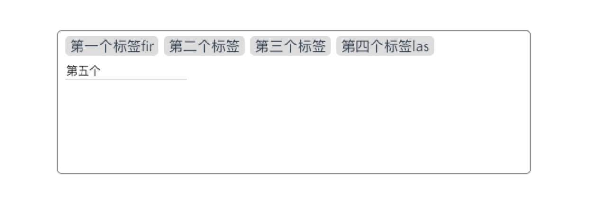

# vue-input-tags

A Vue component to input-tags
一个输入标签返回数组的工具
 ## demo演示
 [demo](https://wei-zhe.github.io/)

## 安装
 
 ```JS
 npm install vue-drag-screenshot -S
 ```

 ## 使用
 
 ```js
 // ES6
import vueInputTags from './lib/index.js'
Vue.use(vueInputTags)

<vue-inputTags 
    v-model   = "parentValue"   // 绑定的数组对象 （必填）
    :width    = "200"           // （必填）
    :height   = "50"            // （必填）
    :setting  = 'setting'       // 设置的参数 （非必填）
>
</vue-inputTags>

setting : {
    wordage     : 3,    // 文字字数
    ArrayLength : 5,    // 标签数量
},
 ```

